# Table of Contents
- [Project Context](#project-context)
- [Website description:](#website-description)
    + [Purpose:](#purpose)
    + [Functionality / feature components:](#functionality---feature-components)
    + [Target audience:](#target-audience)
    + [Tech stack:](#tech-stack)
  * [Additional tech used](#additional-tech-used)
- [User Stories](#user-stories)
    + [Client](#client)
    + [Builder](#builder)
- [Data Flow Diagram:](#data-flow-diagram)
    + [Full Diagram](#full-diagram)
    + [Login and Client Creation Process](#login-and-client-creation-process)
    + [Create Job Process](#create-job-process)
    + [View Jobs Process](#view-jobs-process)
    + [Client Job Payment Process](#client-job-payment-process)
    + [Client Update Job Process](#client-update-job-process)
    + [Builder Update Job Process](#builder-update-job-process)
- [Application Architecture Diagram:](#application-architecture-diagram)
- [Wireframes](#wireframes)
    + [Desktop Diagrams](#desktop-diagrams)
      - [Landing Page](#landing-page)
      - [Jobs Page](#jobs-page)
      - [About / Gallery / Contact Pages](#about---gallery---contact-pages)
      - [Authentication Pages](#authentication-pages)
    + [Tablet Diagrams](#tablet-diagrams)
      - [Landing / Jobs / Gallery](#landing---jobs---gallery)
      - [About / Contanct](#about---contanct)
      - [Authentication](#authentication)
    + [Mobile Diagrams](#mobile-diagrams)
      - [Landing / Jobs / Gallery](#landing---jobs---gallery-1)
      - [About / Contanct](#about---contanct-1)
      - [Authentication](#authentication-1)
- [Project Management](#project-management)
  * [Trello Screenshots](#trello-screenshots)
    + [Early Planning Stage](#early-planning-stage)
    + [Mid Planning Stage](#mid-planning-stage)
    + [Diagrams Completed](#diagrams-completed)

---

## Project Links

- Front end deployed url: https://inspiration-homes.herokuapp.com/
- Front end github: https://github.com/MERN-Boys/inspiration_homes_frontend
- Back end deployed url: https://inspo-homes-api.herokuapp.com
- Back end github: https://github.com/MERN-Boys/inspiration_homes_backend

## Builder Role Explanation

In order to act as the Builder, you must sign in with the default builder email and password:
- email: builder@google.com
- password: password

# Project Context

As student full stack developers, it is necessary that we are able to demonstrate our developing tech skills to potential employers. This is achieved by constructing a complete application from planning through to deployment for a real world client using current technologies and planning tools.

Ths client for this web application is Inspiration Homes, a Builder based on the Gold Coast that performs new home builds and renovation projects. Their requirement was a full website including a gallery of prior work, contact and about pages, along with additional functionality to allow clients and the builder to track current jobs in progress. 

# Website description:

### Purpose:

The purpose of the website is to facilitate the tracking of a builder’s projects for the builder and the client. The website allows clients to view prior completed works, contact the builder to commence a project, and once a project is underway the builder and client are able to track its progress.

### Functionality / feature components:

The features of the website include:
- Landing page.

- Contact page for clients to reach the builder and commence a project with image upload capabilities.

- About page with builder information.

- Gallery page to showcase prior completed works.

- Jobs page to track projects that are currently underway. Builder is able to list build stages, with images, comments and the costs associated with each stage. The client is able to view the progress of the project, make comments, and enter amounts paid to track the total amount owing.

- Authorization, ability to create accounts for new clients.

### Target audience:

The target audience for this web application is clients that are looking to commence a project with a builder. These clients would be interested in being more heavily involved in the build process, supplying comments and supplementary documents throughout the build, and who have an interest in being able to see the progress of the build without visiting the physical site. 

For clients who simply require a builder and would rather monitor the build primarily in person the website contains static pages/components to market the builders services that guide those clients to email the builder directly so they can organise the build with the builder outside of the app.

### Tech stack:

The tech stack that was chosen for this web application is the MERN stack. This consists of:

**MongoDB -** MongoDB is a highly scalable, document orientated, no SQL database that is utilized by the application to store data, with data stored in the JSON format.
 
**Express -** Express.js is a server side, Javascript framework that is used within the backend of the application on top of NodeJS. Express was designed to help build fast, simple and secure web applications.
 
**React -** React.js is a javascript library used to build UI components on the front end. These components are what make up the whole UI for a web based application. React allows a webpage to 'react' to changes to a page without having to reload it.
 
**Node -** Node.js is a Javascript runtime environment that allows JS applications to run on the server side, rather than within a browser. Node JS utilizes the NPM (node package manager), which gives access to a large number of packages.
 
## Additional tech used
 
**Heroku -** Heroku is a cloud hosting service used by developers to manage, deploy and scale 
 
**Git Version Control -** Git is a system that records changes to a file or set of files over time so that you can recall specific versions later.
 
**Cypress -** We plan to make use of the Cypress testing framework to ensure a rigorous unit testing environment for the front and back-end, although this may change during early development.
 
**SCSS and CSS -** Front end styling of react components.
 
**Mongoose -** Mongoose provides a straight-forward, schema-based solution to generate and manipulate MongoDB databases in node/express. 
 
**Putting it Together -** This web application uses the above technologies to create a 3 tiered architecture (frontend, backend, database). The front end is created with React by using components that connect to the back end to provide data, and renders it in HTML in the browser. Express and Node are used on the backend and are used for routing and handling HTTP requests and determining what functions to perform with different requests. These functions access and modify the MongoDB database to provide the data requested.
 

# User Stories
Through use of the Agile methodology, as a team we worked on developing user stories that we deemed necessary to the application. With the initial user stories and wireframes constructed these were sent to the client for approval. Through feedback received we modified user stories to better suit the expected final application use and features that were needed within. One initial user story was removed after consulting with the client: 

**Accept or Deny Jobs -** As a builder, I want the ability to approve and deny incoming jobs, to manage current jobs.

This user story was deemed unnecessary as there is an ability to delete a job as part of the CRUD process.

One user story was added to the Users stories after consulting with the client:

**Contact page -** As a client, I want to contact the builder, so I can begin a project.

This was initially not on the page and a requirement for the client to make an account in order to contact was in place. This has now been revised and an email to contact link was added to the user stories and corresponding wireframes.

### Client
---

**Gallery -**  As a client, I want to view a builders prior work, to assess their competence.

**About page -**  As a client, I want to be able to view more information, to learn more about the builder.

**Contact page -**  As a client, I want to contact the builder, so I can begin a project.

**Contact Image upload -**  As a client, I want to upload blueprints, so the builder can view my plans.

**Authorization -**  As a client, I want to be able to login, to have access to my builds.

**View all jobs  -**  As a client, I want to be able to see all my current jobs, to track their progress.

**Stage image upload -**  As a client, I want to view photos of the build at each stage, so I can track my build(s).

**Stage comments -**  As a client, I want to leave a comment at each stage of the build, so I can inform the builder.

**Stage amount owed -**  As a client, I want to see the amount owed, so I can pay the builder.

**Total amount paid -** As a client, I want to see past amounts paid to the builder, so I can track the total.

### Builder
---

**Gallery -**  As a builder, I want to be able to show prior completed works to prospective clients, to demonstrate my competence

**About page -**  As a builder, I want to show the client more information, so they can learn about me.

**Contact page -**  As a builder, I want prospective clients to be able to contact me, so I can obtain work.

**Contact Image upload -**  As a builder, I want to be able to view clients plans, in order to quote them accurately.

**Authorization -**  As a builder, I want access to all my current jobs, so I can view stage information and details.

**View all jobs -**  As a builder, I want to be able to track multiple jobs at once.

**Stage image upload -**  As a builder, I want to upload photos of completed work, so the client can view finished work.

**Stage comments -**  As a builder, I want to leave comments, to inform the client of stage progress.

**Stage amount owed -** As a builder, I want to be able to adjust the amount owed for each stage on completion, to inform the client of their financial obligations.

**Stage Status -**  As a builder, I want to update stage status, to inform clients of the current build stage.

# Data Flow Diagram:

For the app the major processes that require data sharing between the client, server and database are the Login and Client Creation process, the Client Payment Process, and the Creating, Viewing and Updating Jobs processes.

### Full Diagram
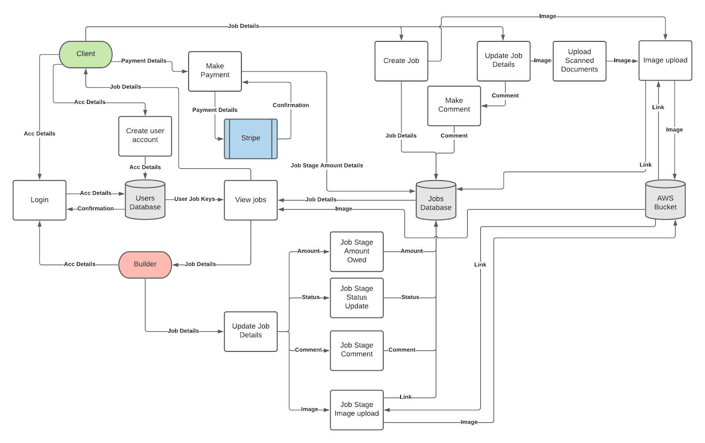

### Login and Client Creation Process
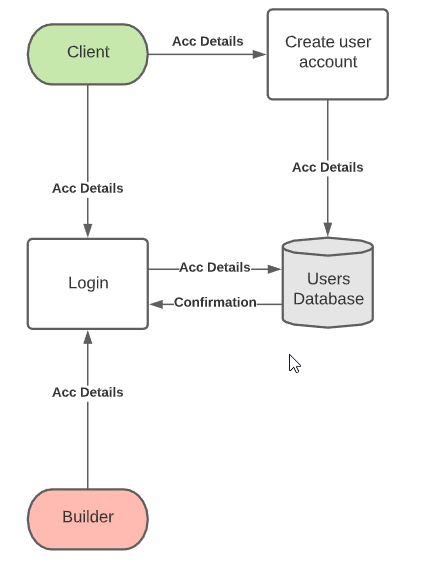

In the Login process Clients and the Builder send account details to the server, which checks them against those same details in the database, and returns a confirmation allowing login or a rejection and prevention of login. 

In the Client Creation process a prospective client will provide new account details to the server, which creates a new instance of User on the database as long as the name and email address are not already in the database.

### Create Job Process
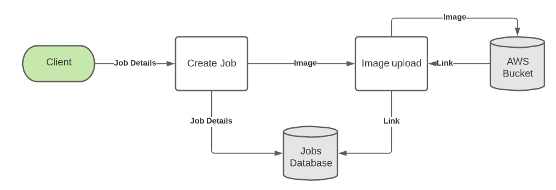

For the Job Crud processes, creating jobs requires the client to send through job information such as design documents and the prospective build address, which the server uses along with the clients User instance to create a new Job instance on the database, then adding the Job’s id as a foreign key in the User instances Job’s array. 

When Images are included in the Job details these images are sent to the AWS Bucket for cloud hosting, which supplies back a link that can be stored in the Job documents array in the database by the server.

### View Jobs Process
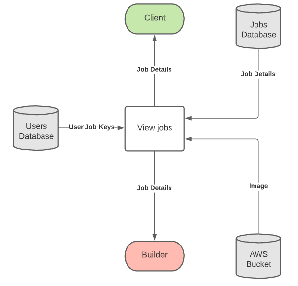

Viewing jobs requires the server requesting all the relevant jobs for that user from the database (all jobs for builder, only client’s jobs for client) and supplying them to the front end.

### Client Job Payment Process
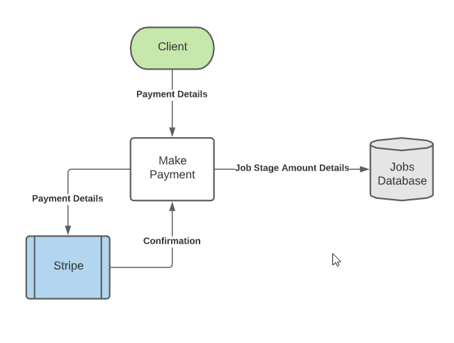

Updating jobs can be done by either the client or the builder. When clients make a payment on the job, payment information is sent from the client to the server and onto Stripe for confirmation. If Stripe returns an OK, then the server updates the amount owed on the Job to an amount less that which was just paid by the client. 

### Client Update Job Process
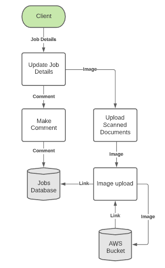

When the client makes a comment on the Job stage this comment is sent to the server which appends it to the Job stage’s comments array in the database. When uploading additional documents the image is sent to the AWS Bucket as in Job creation, a link to the image is returned to the server and uploaded to the database.

### Builder Update Job Process
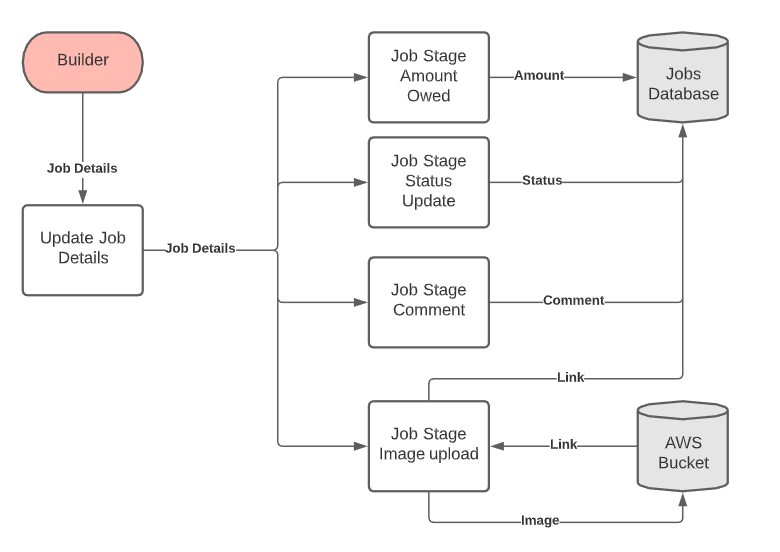

When the builder updates the Job or the Job Stages the data is sent to the server from the client, the server then updates the correct job with the new Stage Amount/Stage Status or Stage Comment. When uploaded images to Job stages, in a similar fashion to when clients upload design documents, the front-end sends the image to the AWS bucket and the returned link is sent to the server to be added to the corresponding stage in the Job instance on the database.

---

# Application Architecture Diagram:

Clarification and explanation of diagram

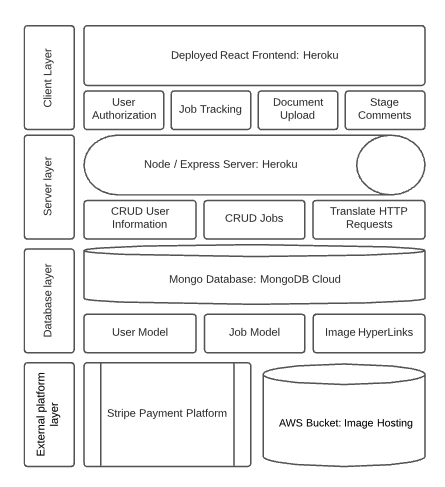

As can be seen from the diagram above, the application is separated into four different layers, consisting of the client layer, the server layer, the database layer and the external platform layer. On the client layer the user makes changes to the application state, which communicates with the server layer through HTTP requests. 

The server layer communicates with the database depending on the request and retrieves the corresponding data to fulfill the request. Through the user model, job model and image hyperlinks communicate with the external platform layer to handle payment and provide hosted images to the browser.

---

# Wireframes

When developing the wire frames for the client, we used the agile methodology to ensure we were prioritizing client needs by discovering their requirements and developing solutions based upon this.

This process involves planning, designing, developing, testing,  followed by releasing to the client in order to acquire feedback and repeating the process if necessary. This was performed within this project by planning with user stories and designing the structure of the application through application architecture and dataflow diagram. Wireframes were developed based upon these documents and tested against the user stories outlined previously.

On completion of testing, wireframes were released to the client and feedback was received regarding the color pallet to be used and gallery layout. The agile process was repeated and new wireframes were constructed with this feedback in mind and again released to the client with them then giving approval on the final designs below:

### Desktop Diagrams
#### Landing Page
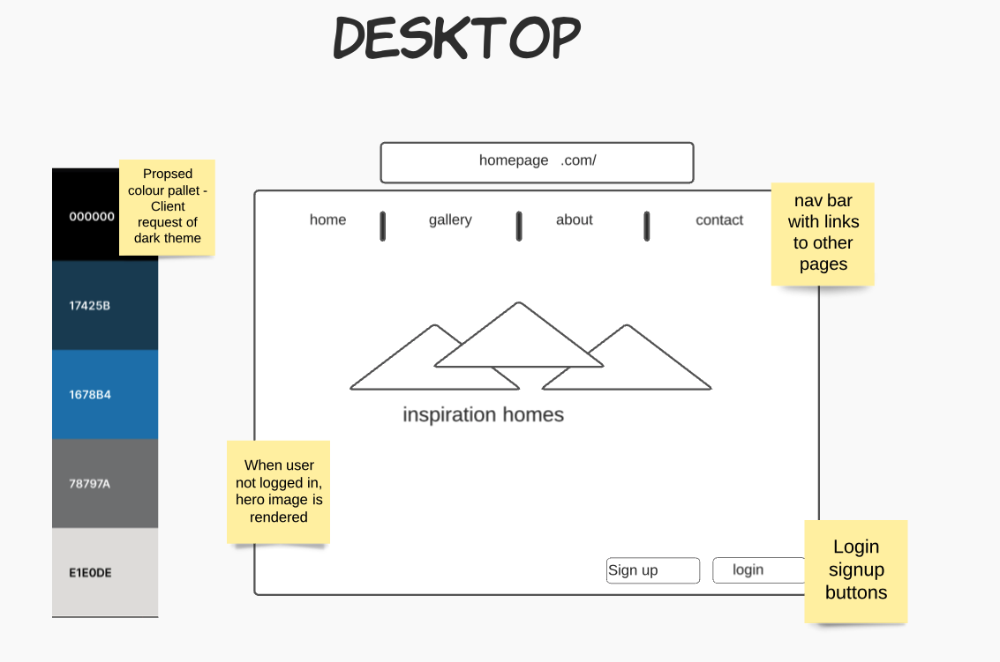
#### Jobs Page

#### About / Gallery / Contact Pages
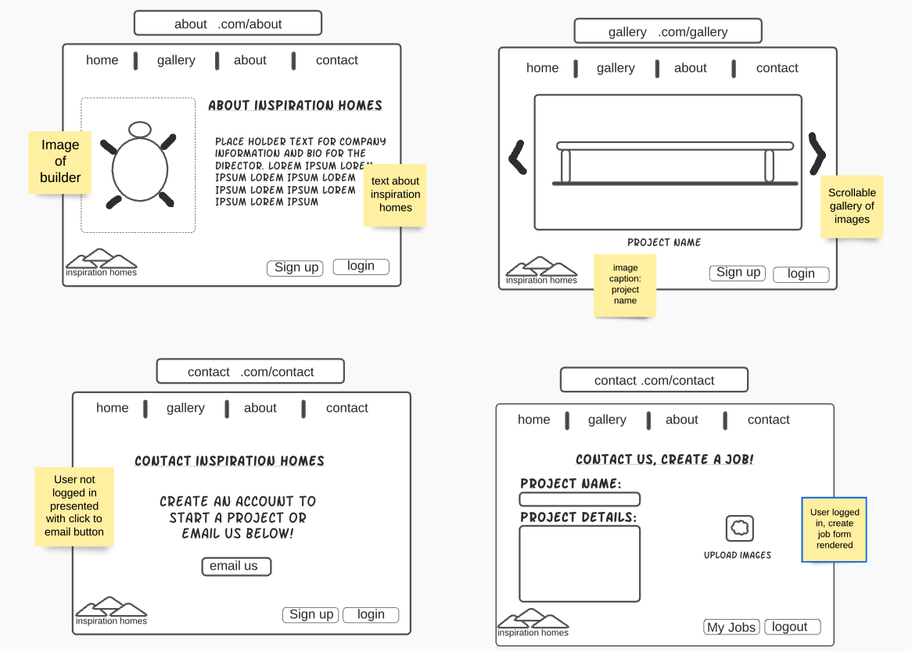
#### Authentication Pages
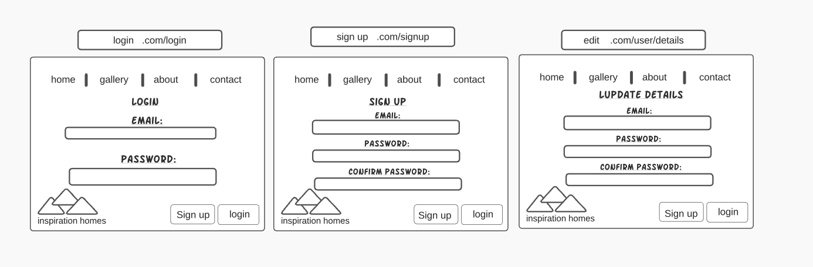

### Tablet Diagrams
#### Landing / Jobs / Gallery
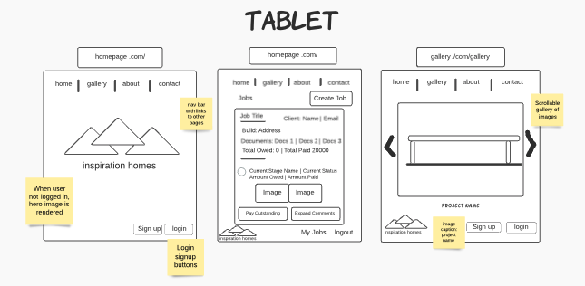
#### About / Contact
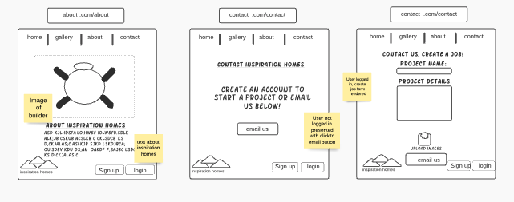
#### Authentication

### Mobile Diagrams
#### Landing / Jobs / Gallery
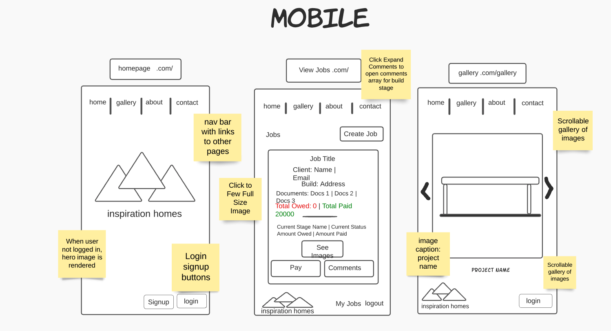
#### About / Contact
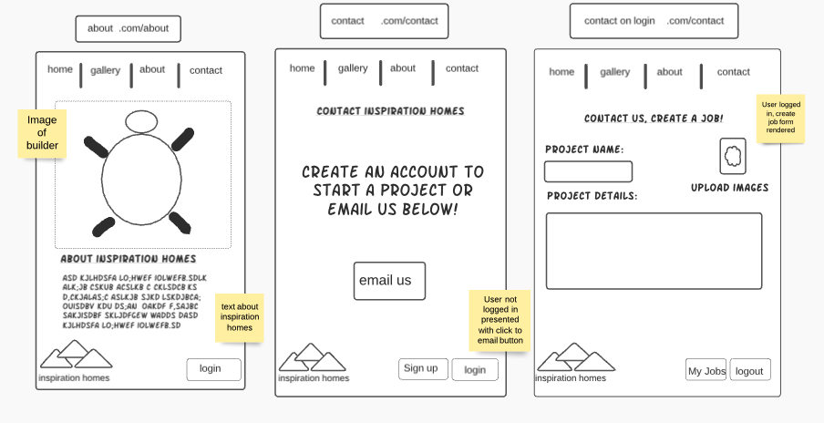
#### Authentication
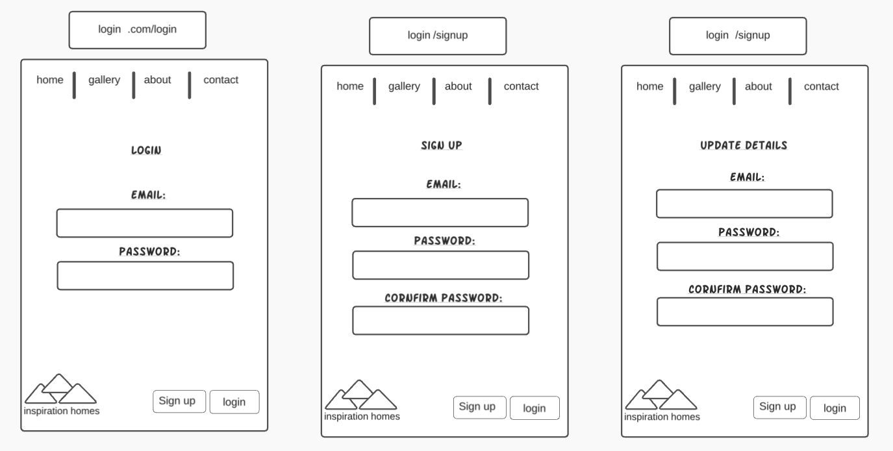

---
# Project Management
Trello Link: https://trello.com/b/ZmoHCKbb/inspo-homes

**Project management** is the practice of organising teams to achieve goals and meet success criteria within a specified time. For this project the first thing we did was create a discord server and brainstorm ideas, collaboratively building up a scaffold for the app based on the classes it would need, and the pages we wanted.

After obtaining approval to begin working on the app, we discussed how we were going to keep track of our progress and delegate tasks. We decided to use a number of different technologies to assist in collaboration, but primarily: Discord for ongoing communication and link sharing, Google Docs for shared documentation writing, Trello using Kanban Agile Methodology for setting up tasks to be done and to delegate to team members, and Github for distributed source control when we begin coding.

Following this, the team worked on building out the user stories to cover all the features we brainstormed, adding these to Trello, working on wireframes, discussion and diagramming of the planned application architecture and data flow of the application, and testing to make sure our understanding of the Git Forking Workflow was adequate for completion of the project. Through a series of critical feedback sessions the data flow diagrams in particular went through a number of changes in the planning stage, resulting in a series of separate diagrams focusing on outlining particular processes in isolation.

Once the project documentation is finalised, coding will begin. First we plan on building out the foundation: establishing the Database and its Models, creating the node/express server and some of the routes, and then getting a scaffold of the react frontend up and running and connected to the backend. After this we will then delegate the Trello tickets relating to each of the planned app features to each of the group members based on feature experience/knowledge/workload. 

During the course of the project we will monitor each other’s progress, ticking off features as we complete them, attaching the appropriate commits, and adjusting each team member’s workload where appropriate.

## Trello Screenshots

### Early Planning Stage
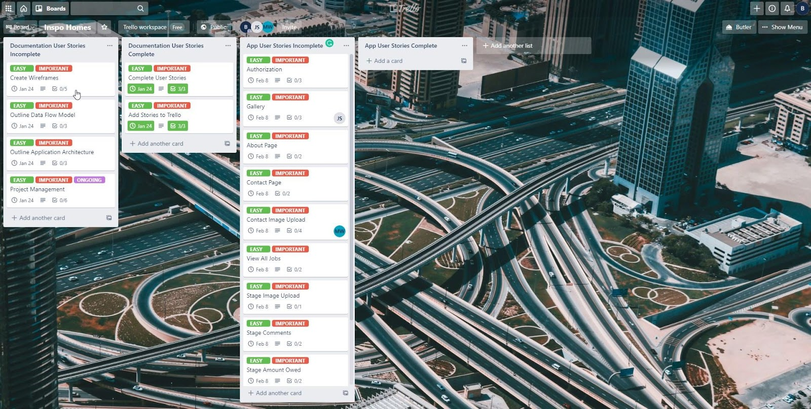

### Mid Planning Stage
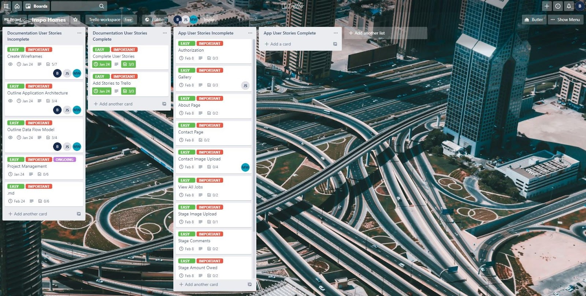

### Diagrams Completed
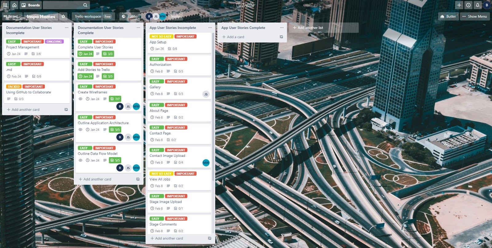

### Markdown Completed
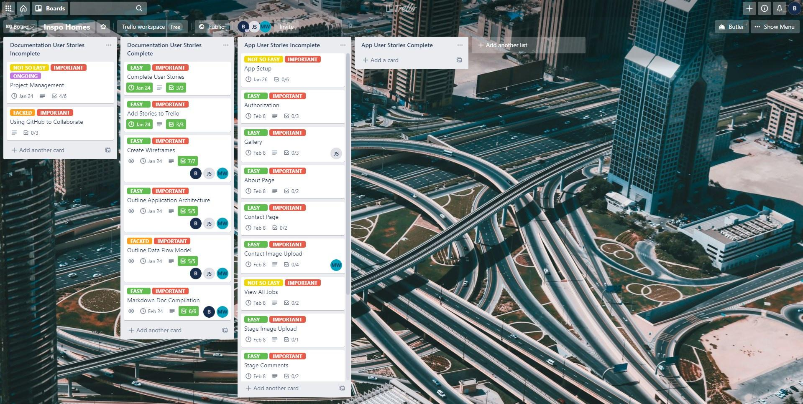

### Before Submission 
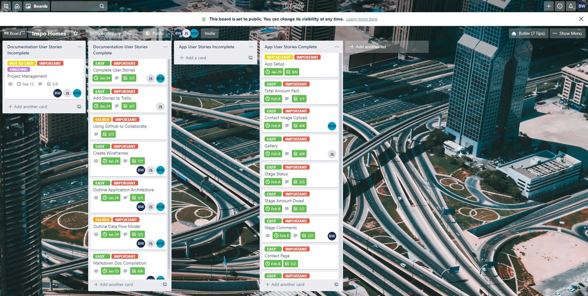

## Group Member User Stories

- As part of the planning process we drafted user stories for ourselves to follow when building the application to outline why we are completing different parts of the planning documentation and understand what purpose they serve:

- As a group member I want to complete the user stories so I can start outlining features of the app

- As a group member I want to add the stories to trello to track what has and hasn’t been done

- As a group member I want to outline the data flow model to understand how the app will function, how servers and databases will be accessed, and better understand the control flow of the application

- As a group member I want to outline the application architecture, so that I know what the most important parts of the app are, and what platforms will be used

- As a group member I want to complete the wireframes, so that I know how the app is supposed to look and determine how the features planned will be interacted with by the user

- As a group member I want to outline how the project will be managed, to ensure that everyone knows what they’re doing, when they need to complete it by, and that the project gets completed on time.

## Database Models Planning

As part of the planning process we outlined the database model structure and the data types used within it:

### User will have

- Primary key id
- Name = String

- Email = String

- Password = String

- Role [SuperAdmin/Admin/ Client] = String

- Jobs Array of Job Class Obj = Array of foreign_keys

### Job will have a:

- Primary key id
- JobComplete? = Boolean

- Client = Class Obj required for_key

- Job Title = String required

- Build Address = String required

- Build Design Documents = PDF/Img array

- Stages = Obj array generated from seed

  Each Obj contains:

  - StageIndex =  Number (To keep track of the order they get presented in the app, can reorder them though and if builder needs to create new stage can customise where in the build order it should be by editing this number)

  - StageStatus = String (Hidden/InProgress/PaymentPending/Complete)

  - StageName = String // Stage Placeholder Names: Pending, Ground Works, Base, Frame, Lock Up/Enclosed, Fixing/Fit Off, PCI, Handover

  - Amount Owed = Number

  - Amount Paid = Number

  - Pics =  Image/Link

  - Comments = [{ User Obj, Comment}, { User Obj, Comment}, { User Obj, Comment}]

## Pages and Component planning

**As part of the planning process we outlined the pages that are required for the application and the components and features of each page:**

Nav component:

Links to login/logout
Links to Home/ Jobs/Gallery/About/Contact

Home:

- Nav Component
- Landing page

Jobs:

- Nav Component
- See all users jobs (Clients jobs for client, all jobs for builder)
- For client add ability to create new job
- For client after read only except has option to commit money to the job and add comments at each stage
- For builder stages can be edited/added
- Buttons to make payments and forms to change stage states
- Email Confirmation after payment with receipt
- Button to mark Job as Complete and add to Archived Jobs
- Send Email when status of Job changes (New Stage, New Payment Due, etc)

Gallery:

- Nav Component
- Pictures of Builds and testimonials from the clients, can be hardcoded, stretch goal to make more dynamic/editable

About:

- Nav Component
- Bio of Builder, bit of history etc (Get some deets from old mate)

Contact:

- Nav Component
- Create Job form that requires:
    - Client Account for Authentication
        - Build details - PDF/Image
        - Build Address
- Create Job Form:
    - Creates Pending Job Add to Client
    - Sets Job Stage to Pending
    - Send email about new Job to Builder

Sign Up:

- Nav Component
- Client Registration
    - Name
    - Email
    - Password
- Create Client Form
    - Create Client User Obj in Database
    - Sends email about new Client to Builder
    - Sends email confirming registration to Client